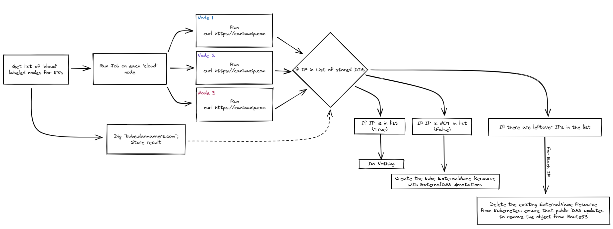

# Cloud Ingress Watcher

Working on a pythonic way to run jobs and update the public facing A-Records for my domain, `kube.danmanners.com` for my Talos OS cloud edge nodes.

## General Logic

This is _sort of_ the flow I'm thinking of building out, but this may change.

> Right now, this is all scratchpad code while I figure everything out.
